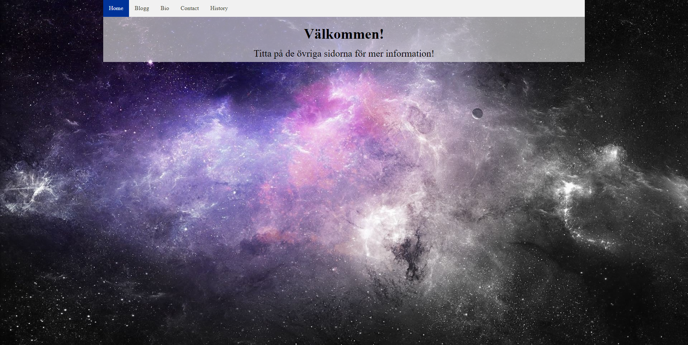

# wu1_agbe
### School Project In Webdevelopement
# Utvecklingsprojekt i Webbutveckling 1
*Agne Bergström*

## Bakgrund

## Planering
### Innehåll:
### Layout

### Färgval

##### Element
###### HEX f1f1f1 
###### RGB 241,241,241

##### Huvudsaklig färg
###### HEX 003399 
###### RGB 0,53,153

##### Beteende
###### HEX 847964 
###### RGB 132,121,100

##### Text
###### HEX 363724 
###### RGB 54,55,36

### Typsnitt
Inget särskilt utan det som finns på användarens dator.

### Mockup

### Dokumentation

#### Uppgiften

Uppgiften vi fick var att skapa en blogg eller portfolio.

#### Genomförande

Det allra första för att kunna börja på koden var att skissa hur hemsidan skulle se ut samt göra en mockup. 

Efter skissen och mockupen gjorde jag en planering och började sedan på koden.

Jag la först in bakgrundsbilden och stylade den så att den automatiskt ändrar sig efter storleken på skärmen som visar hemsidan. När det var färdigställt la jag in HTML samt CSS koden för navigationsbaren och artikeln. Dessa la jag i en wrapper som täcker 70% av sida till sida och 100% i height. Jag la sedan in styling för navigationsbaren och artikeln i CSS och fick de att se ut som de gör. 

Efter tester körda kom jag fram till att artikelns text fortsätter neråt på det sättet jag vill (fortsätter neråt och skapar en scrollbar när texten kommer ur bildrutan. Problemet med detta var att wrappern inte hängde med texten utan stannade bara efter den täckt upp den del av skärmen som visades. Detta löste jag genom att skapa en klass med en container innanför wrappern som jag säger åt ska vara responsiv till texten, det vill säga att den ska förändras med texten. 

Jag sa åt wrappern att vara responsiv till den nyskapade klassen. Detta leder till att om texten kommer ur bild så fortsätter den vita bakgrunden så länge texten finns där samt skapar en scrollbar som gör att du kan scrolla för att se resterande text. Det var precis det jag tänkte mig men med denna metoden att lösa problemet gör även så att ifall texten inte täcker upp hela sidan så kommer wrappern bara täcka upp den del som texten tar upp.

Jag hade ont om tid vilket ledde till att jag slutförde hemsidan direkt utan att göra genomförandeplanen. 

#### Resultat

##### Testresultat av w3c’s validator: 

##### HTML:

##### CSS:

##### Resultatet

Resultatet som jag fick fram är enligt mig bra och jag tycker om hur det ser ut. 

#### Förbättringar
Ett problem som jag inte lyckas lösa är som visat på bild 1 och 2av resultatet är att wrappern är responsiv till texten vilket gör så att den vita bakgrunden bara täcker upp tillräckligt för texten. 
Jag har inte heller lyckats lägga in submit knappar på bloggsidan för att kunna ladda upp inlägg (i teorin).

### Kod

#### HTML Index: 

<!DOCTYPE html>
<html lang="en">
<head>
    <meta charset="UTF-8">
    <meta name="viewport" content="width=device-width, initial-scale=1.0">
    <meta http-equiv="X-UA-Compatible" content="ie=edge">
    <!-- Website title -->
    <title>Bloggen</title>
    <!-- CSS -->
    <link rel="stylesheet" href="./assets/css/blogg.css">
</head>
<body>
    

        <!-- Navbar -->
        <nav class="topnav">
            <a class="active" href="javascript:void(0)">Home</a>
            <a href="./blogg.html">Blogg</a>
            <a href="./about.html">Bio</a>
            <a href="./contact.html">Contact</a>
            <a href="./history.html">History</a>
        </nav>
        <!-- Main -->
        <main>
            

            <article>
                <!-- Page title -->
                <h1>Välkommen!</h1>
                <!--  Content -->
                
                    Titta på de övriga sidorna för mer information!
                
            </article>
            

        </main>
    

</body>
</html>

#### HTML Blogg:

<!DOCTYPE html>
<html lang="en">
<head>
    <meta charset="UTF-8">
    <meta name="viewport" content="width=device-width, initial-scale=1.0">
    <meta http-equiv="X-UA-Compatible" content="ie=edge">
    <!-- Website title -->
    <title>Bloggen</title>
    <!-- CSS -->
    <link rel="stylesheet" href="./assets/css/blogg.css">
</head>
<body>
    

        <!-- Navbar -->
        <nav class="topnav">
            <a href="index.html">Home</a>
            <a class="active" href="javascript:void(0)">Blogg</a>
            <a href="./about.html">Bio</a>
            <a href="./contact.html">Contact</a>
            <a href="./history.html">History</a>
        </nav>
        <!-- Main -->
        <main>
            

            <article>
                <!-- Page title -->
                <h1>Bloggen</h1>
                <!--  Content -->
                 
                
                    En hund jag hittade på internet som jag tyckte var gullig!
                
                
<i>Publicerad den 17/5-2019</i>

            </article>
            

        </main>
    

</body>
</html>

#### HTML Bio:

<!DOCTYPE html>
<html lang="en">
<head>
    <meta charset="UTF-8">
    <meta name="viewport" content="width=device-width, initial-scale=1.0">
    <meta http-equiv="X-UA-Compatible" content="ie=edge">
    <!-- Website title -->
    <title>Bloggen</title>
    <!-- CSS -->
    <link rel="stylesheet" href="./assets/css/blogg.css">
</head>
<body>
    

        <!-- Navbar -->
        <nav class="topnav">
            <a href="./index.html">Home</a>
            <a href="./blogg.html">Blogg</a>
            <a class="active" href="javascript:void(0)">Bio</a>
            <a href="./contact.html">Contact</a>
            <a href="./history.html">History</a>
        </nav>
        <!-- Main -->
        <main>
            

            <article>
                <!-- Page title -->
                <h1>Agne Bergström</h1>
                <!--  Content -->
                
                    <b>Skola:</b> Thorén Innovation School Göteborg  
                    <b>Bor:</b> Kungälvs Kommun, Kärna   
                    Hejsan!  
                    Jag är 18 år och har precis skaffat körkort för både bil och mc. Jag håller nuvarande på med plugg i skolan vilket då körkorten underlättar. Iochförsig så fungerar ju <i>Västtrafiks</i> kollektivtrafik väldigt bra.
                
            </article>
            

        </main>
    

</body>
</html>

#### HTML Contact:

<!DOCTYPE html>
<html lang="en">
<head>
    <meta charset="UTF-8">
    <meta name="viewport" content="width=device-width, initial-scale=1.0">
    <meta http-equiv="X-UA-Compatible" content="ie=edge">
    <!-- Website title -->
    <title>Bloggen</title>
    <!-- CSS -->
    <link rel="stylesheet" href="./assets/css/blogg.css">
</head>
<body>
    

        <!-- Navbar -->
        <nav class="topnav">
            <a href="./index.html">Home</a>
            <a href="./blogg.html">Blogg</a>
            <a href="./about.html">Bio</a>
            <a class="active" href="javascript:void(0)">Contact</a>
            <a href="./history.html">History</a>
        </nav>
        <!-- Main -->
        <main>
            <!-- Contact formula  -->
            

                <label for="fname">First Name</label>
                <input type="text" id="fname" name="firstname" placeholder="Your name...">
                <label for="lname">Last Name</label>
                <input type="text" id="lname" name="lastname" placeholder="Your last name...">
                <label for="country">Country</label>
                <select id="country" name="country">
                  <option value="Choose country">Choose country...</option>
                  <option value="Sweden">Sverige</option>
                  <option value="Norway">Norway</option>
                  <option value="Finland">Finland</option>
                  <option value="Denmark">Denmark</option>
                </select>
                <label for="subject">Subject</label>
                <textarea id="subject" name="subject" placeholder="Write something..." style="height:200px"></textarea>
                <input type="submit" value="Send">
            

        </main>
    

</body>
</html>

#### HTML History:

<!DOCTYPE html>
<html lang="sv">
<head>
    <meta charset="UTF-8">
    <meta name="viewport" content="width=device-width, initial-scale=1.0">
    <meta http-equiv="X-UA-Compatible" content="ie=edge">
    <!-- Website title -->
    <title>Bloggen</title>
    <!-- CSS -->
    <link rel="stylesheet" href="./assets/css/blogg.css">
</head>
<body>
    

        <!-- Navbar -->
        <nav class="topnav">
            <a href="./index.html">Home</a>
            <a href="./blogg.html">Blogg</a>
            <a href="./about.html">Bio</a>
            <a href="./contact.html">Contact</a>
            <a class="active" href="javascript:void(0)">History</a>
        </nav>
        <!-- Main -->
        <main>
            

            <article>
                <!-- Page title -->
                <h1>Datorns Historia</h1>
                <!--  Content -->
                
                Jag har valt att skriva om dataspel därför att det finns mycket fakta och det är ett intressant ämne enligt mig.  
Dataspel kan användas till många olika saker såsom: läromedel, social interaktion och en källa till glädje m.m. Genom dessa områden har dataspel influerat världen och det har blivit en del av vardagen för många.  
Genom internet har dataspel utvecklats mycket. Från första början så fanns dataspel på konsoler och man var tvungen att ta sig till spel arkader. Nuförtiden däremot så kan man spela dataspel på nästan alla föremål som innehåller en slags dator. Det har genom internet bildats något som kallas online multiplayer. Detta innebär att man kan spela med eller mot varandra på olika platser runtom i världen. Skulle man spela tillsammans innan internet tog kraft i dataspel så var man tvungen att spela på samma konsol och titta på samma skärm då man använde en teknik som heter splitscreen. Splitscreen går ut på att dela upp skärmen och konsolen i flera profiler som spelar samtidigt i samma spel. Detta har dock försvunnit under åren då det har blivit för kraftfulla spel för att kunna dela spelen på flera spelare i samma dator eller konsol.  
Många ser dataspel som en dålig vana eller ett beroendeframkallande hot som förstör för ungdomar då det spelas mer än vad det görs läxor. Många argumenterar för att dataspel har en positiv inverkan då man kan träna till exempel reaktionsförmågan och periferiseendet i spel som kräver fokus och snabba reaktioner. Man kan spela spel som pussel där det krävs mycket hjärnkapacitet och bra minne för att kunna klara av spelet.  
Majoriteten av ungdomar och barn spelar idag dataspel runtom i världen. Om man frågar ungdomar i urbaniserade områden så är det många som säger att de på något sätt spelar dataspel, om det så är i mobilen eller på konsol/dator. Eftersom dataspel är en så stor del av vardagen för många så hade det blivit katastrof om det hade försvunnit. Om dataspel däremot aldrig hade uppfunnits så tror jag att det hade blivit mer kontakt utomhus. Mer träffar och kanske mer grillkvällar. Det går dock inte att säga att dataspel har fått personer att glida ifrån varandra då det är många som träffar kompisar genom dataspel.  

<b>Hur fungerar då dataspel?</b>  
Dataspel är en kodning som med hjälp av bilder får ihop ett 3D eller 2D animerat interaktivt gränssnitt. För att få ett dataspel att bli ett online multiplayer behöver man servrar som har spelet lagrat på sig. Genom att personer laddar ner spelet på sitt föremål kan flera personer sedan kommunicera med varandra genom servern som ser till att det någon gör påverkar någon annan.  
Dataspel har kommit långt sen man skapade det. Från enkla 2D animeringar till interaktiva 3D världar som nästan ser helt realistiska ut. Dock så har komponenterna som driver det hela höjts extremt mycket och de klarar mycket mera än vad de gjorde då.  

<b>Källa:</b>
Rhodes, Glen. Utgivningsår: 2007.  Flash Professional 8 Game Development. Charles River Media.  
                
            </article>
            

        </main>
    

</body>
</html>

#### CSS:

/* Page setup */

* {
    margin: 0;
    padding: 0;
}

html, body {
    height: 100%;
    overflow: auto;
}

/* Background */

html {
    background-image: url('https://get.pxhere.com/photo/nature-light-sky-sun-night-sunlight-cosmos-atmosphere-space-blue-galaxy-moon-solar-globe-world-nebula-outer-space-science-astronomy-earth-design-stars-universe-bright-planet-alien-fantasy-orbit-astronomical-object-1234281.jpg');
    background-size: auto;
    font-size: 16px;
}

/* Basic setup */

body {
    width: 100%;
    font-size: 20px;
}

br {
      line-height: 200%;
   }

   span {
       font-weight: 400;
   }

/* Page title */

h1 {
    margin-top: 1rem;
    margin-bottom: 1rem;
}

/* Background wrapper */

#wrapper{
    background-color: rgba(241,241,241, 0.6);
    width: 70%;
    margin: 0 auto;
    height: auto;
}

/* Article box */

article {
    padding: .5rem 1rem;
    background-color: transparent;
    font-size: 1.4vw;
}

article p {
    font-size: 1.2rem;
}

/* Navbar */

.topnav {
    position: sticky;
    top: 0;
    overflow: hidden;
    width: 100%;
    background-color: #f1f1f1;
    color: black;
    margin-bottom: 0;
}
.topnav a {
  float: left;
  color: #363724;
  text-align: center;
  padding: .875rem 1rem;
  text-decoration: none;
  font-size: 1.025rem;
}
.topnav a:hover {
    background-color: #ddd;
    color: black;
}
.topnav a.active {
    background-color: #003399;
    color: white;
}

/* Text align */

.hello {
    background-color: transparent;
    text-align: center;
}

/* Contact formula */

input[type=text], select, textarea {
  width: 100%;
  padding: 12px;
  border: 1px solid #ccc;
  border-radius: 4px;
  box-sizing: border-box;
  margin-top: 6px;
  margin-bottom: 16px;
  resize: vertical
}

input[type=submit] {
  background-color: #003399;
  color: #f1f1f1;
  padding: 12px 20px;
  cursor: pointer;
}

input[type=submit]:hover {
  background-color: #003399;
}

/* White container background */

.container {
  background-color: #f1f1f1;
  padding: 20px;
}
