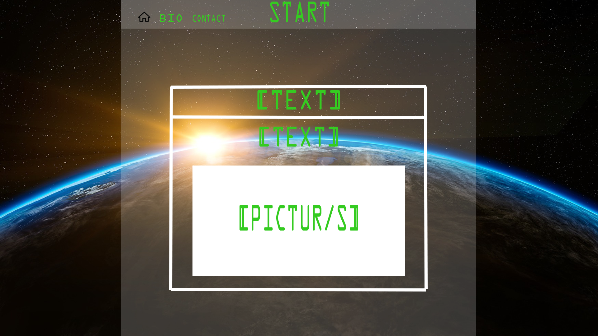
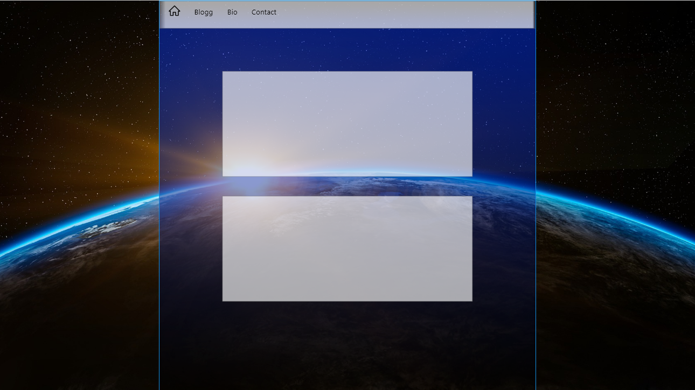
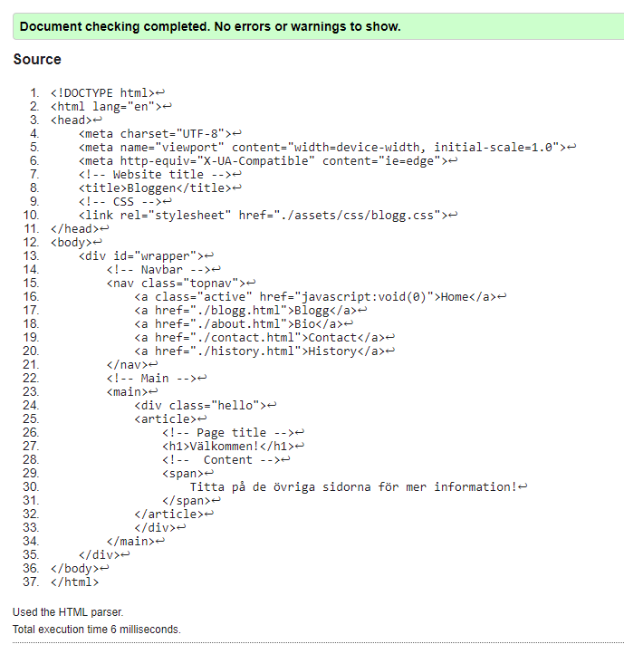
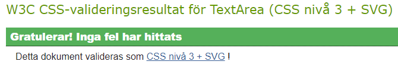
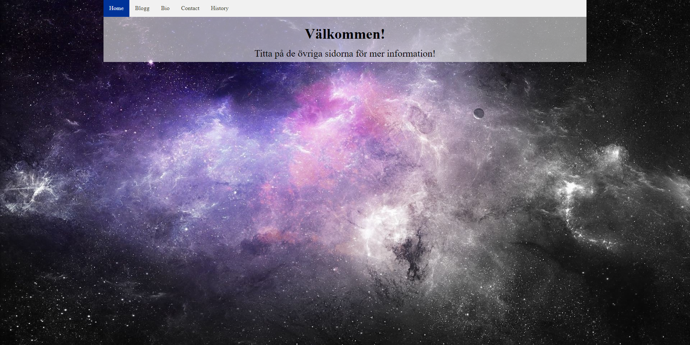
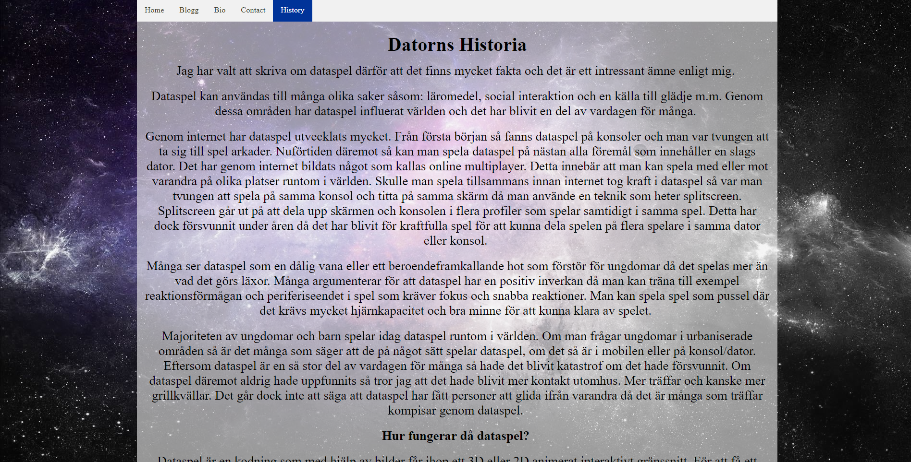
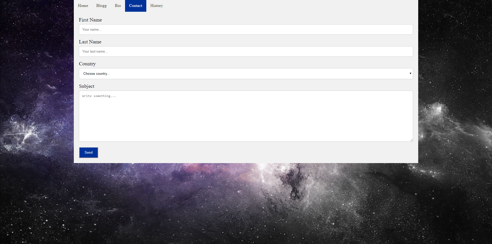

# wu1_agbe
### School Project In Webdevelopement
# Utvecklingsprojekt i Webbutveckling 1
*Agne Bergström*

## Bakgrund

## Planering
### Innehåll:
### Layout

### Färgval

##### Element
###### HEX f1f1f1 
###### RGB 241,241,241

##### Huvudsaklig färg
###### HEX 003399 
###### RGB 0,53,153

##### Beteende
###### HEX 847964 
###### RGB 132,121,100

##### Text
###### HEX 363724 
###### RGB 54,55,36

### Typsnitt
Inget särskilt utan det som finns på användarens dator.

### Mockup

### Dokumentation

#### Uppgiften

Uppgiften vi fick var att skapa en blogg eller portfolio.

#### Genomförande

Det allra första för att kunna börja på koden var att skissa hur hemsidan skulle se ut samt göra en mockup. 

Efter skissen och mockupen gjorde jag en planering och började sedan på koden.

Jag la först in bakgrundsbilden och stylade den så att den automatiskt ändrar sig efter storleken på skärmen som visar hemsidan. När det var färdigställt la jag in html samt css koden för navigationsbaren och artikeln. Dessa la jag i en wrapper som täcker 70% av sida till sida och 100% i height. Jag la sedan in styling för navigationsbaren och artikeln i css och fick de att se ut som de gör. 
Efter tester körda kom jag fram till att artikelns text fortsätter neråt på det sättet jag vill (fortsätter neråt och skapar en scrollbar när texten kommer ur bildrutan. Problemet med detta var att wrappern inte hängde med texten utan stannade bara efter den täckt upp den del av skärmen som visades. Detta löste jag genom att skapa en klass med en container innanför wrappern som jag säger åt ska vara responsiv till texten, det vill säga att den ska förändras med texten. Jag sa åt wrappern att vara responsiv till den nyskapade klassen. Detta leder till att om texten kommer ur bild så fortsätter den vita bakgrunden så länge texten finns där samt skapar en scrollbar som gör att du kan scrolla för att se resterande text. Det var precis det jag tänkte mig men med denna metoden att lösa problemet gör även så att ifall texten inte täcker upp hela sidan så kommer wrappern bara täcka upp den del som texten tar upp.
Jag hade ont om tid vilket ledde till att jag slutförde hemsidan direkt utan att göra genomförandeplanen. 

#### Resultat

##### Testresultat av w3c’s validator: 

##### HTML:

##### CSS:

##### Resultatet

Resultatet som jag fick fram är enligt mig bra och jag tycker om hur det ser ut. 

#### Förbättringar
Ett problem som jag inte lyckas lösa är som visat på bild 1 och 2av resultatet är att wrappern är responsiv till texten vilket gör så att den vita bakgrunden bara täcker upp tillräckligt för texten. 
Jag har inte lyckats lägga in submit knappar på bloggsidan för att kunna ladda upp inlägg (i teorin).

### Kod
